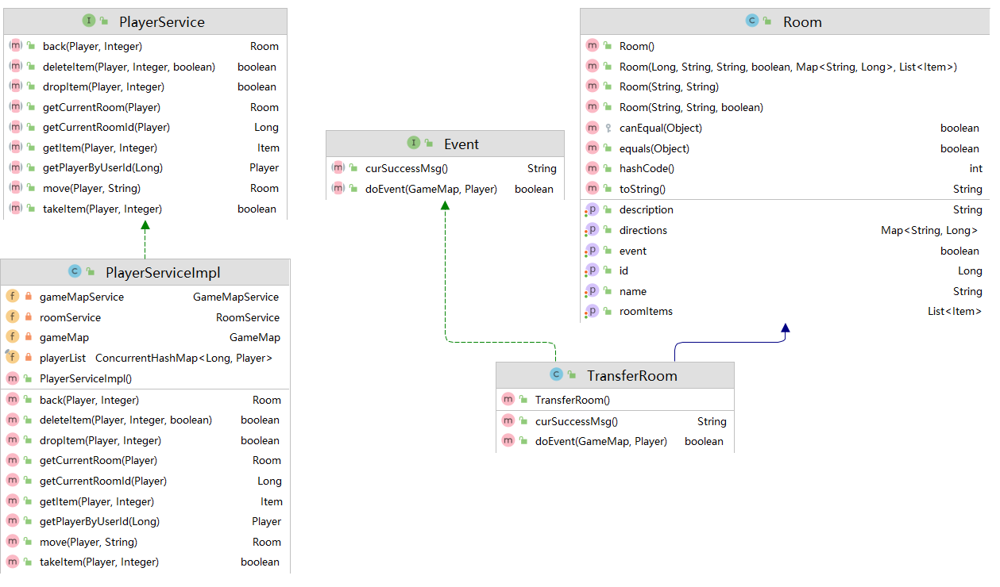
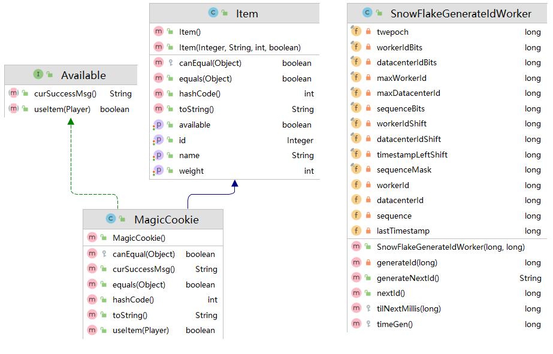
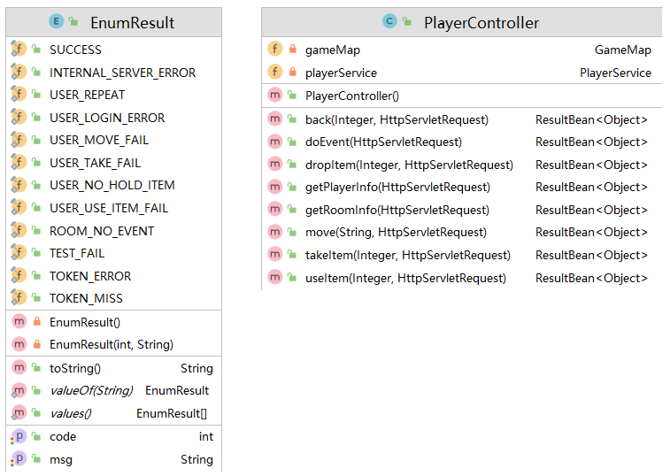
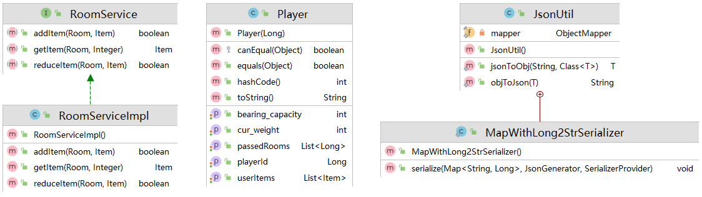
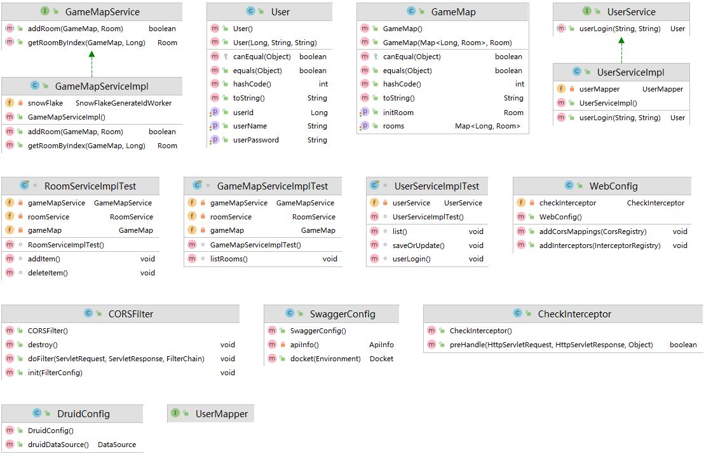
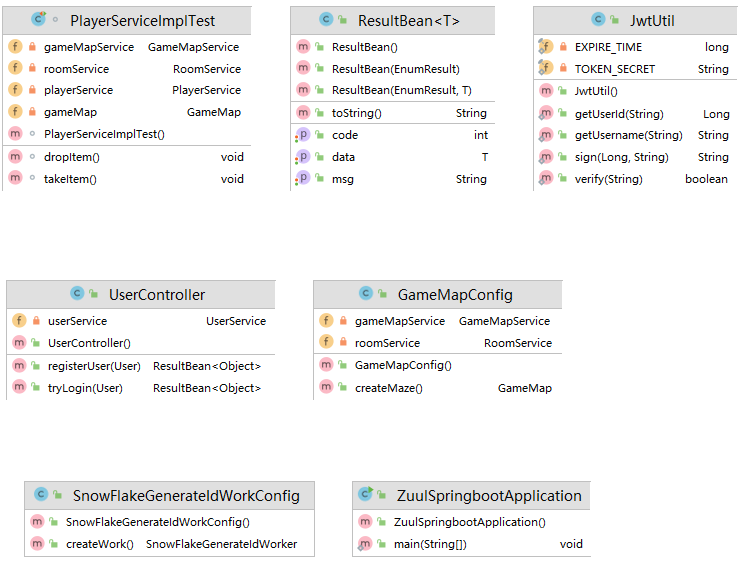

<h1 align="center">软件工程实践：小组开发报告</h1>

## 1. 特殊情况声明

上报的开发小组成员只有我一人，所以我自己模拟了几个开发角色，以下是虚拟小组成员结构。

组长：邢淳杰（项目负责人）

组员：邢淳杰（后端开发人员-1）、邢淳杰（后端开发人员-2）、邢淳杰（后端测试人员-1）

外援：陶志远（前端开发人员-1）

补充说明：邢淳杰（我）之前因身体原因休学，复学后办理了校外住宿，因为跟20级的同学不太熟悉，沟通也不太方便，再加上有关合作开发（github分支合并、代码冲突、版本回退）的内容我之前在大三上的时候和室友做课程设计都有实践过，也算是比较熟悉了，这次实在是不太方便，所以这次实践课程就自己一个人作为一个小组，自己一个人写一下后端。前端的内容我原本准备自己尝试一下，但由于难度比较大（其实是因为我前端太菜），再加上期末任务繁重时间紧迫，预感到无法在截止期限以前完成前端的开发工作，所以找了一个外援陶志远同学来完成前端的开发工作。我们使用接口管理工具Apifox进行前后端接口的对接和测试。

<br><br>

## 2. 需求分析与项目总体设计

### 2.1 确定需求

经过讨论，小组确定功能扩充需求点如下：

1. 扩展游戏，一个房间里可以存放任意数量的物件，每个物件有一个描述和一个重量值，玩家进入一个房间后，查看当前房间的信息以及房间内的所有物品信息；
2. 扩展并实现一个高级“back”命令功能，可以一次性回退到指定步数（可以回到前一次进入的Room，也可以回到前n次进入的Room）；
3. 在游戏中实现具有传送功能的房间，当玩家进入这个房间，会被传送到游戏地图的其它房间；
4. 玩家在游戏中的功能需求：
   * 一个玩家因该与它的用户相关联（绑定）
   * 玩家可以随身携带任意数量的物件，但随身物品的总重量不能操过某个上限值；
   * 在游戏中增加两个新的命令“take”和“drop”，使得玩家可以拾取房间内的指定物品或丢弃身上携带的某件或全部物品，当拾取新的物件时超过了玩家可携带的重量上限，系统应给出提示；
   * 在游戏中增加一个新的命令“items”, 可以打印出当前房间内所有的物件及总重量，以及玩家随身携带的所有物件及总重量；
   * 在某个或某些房间中随机增加一个magic cookie（魔法饼干）物件，并增加一个“eat cookie”命令，如果玩家找到并吃掉魔法饼干，就可以增长玩家的负重能力；
5. 扩充游戏基本架构，使其支持网络多人游戏模式，具备玩家登陆等功能；
6. 为单机或网络版游戏增加图形化用户界面，用过可以通过图形化界面执行游戏功能；
7. 为游戏增加数据库功能，用于保存用户设置；

<br>

### 2.2 需求分析与技术选型

游戏要有用户登录/注册的功能，要有交互界面，所以采用前后端分离的方式进行开发。经过综合考虑，我们决定采用`B/S`架构进行开发，前端通过浏览器页面进行展示，并实现与用户的交互，后端部署在服务器上，提供数据处理、实现游戏核心逻辑等服务。用户的信息通过数据库进行持久化存储。

经过商议，我们小组决定使用`Spring Boot + Vue`的技术栈开发**神秘国度**项目，为了方便后端项目使用`Github actions`的`CI/CD`流程，项目的后端将与前端分离，单独存放在一个仓库中。

后端项目部署方案：首选方案为通过`Github actions`的`CI/CD`流程实现后端项目的自动云部署。如果部署失败，则采用备选方案，后端由开发人员手动部署在项目组长（我）的阿里云服务器上。

前端项目部署方案：由于前端属于临时外援，所以部署方面不作要求。

前后端具体的技术栈将在后续章节中列出。

<br>

### 2.3 游戏逻辑设计

注：游戏逻辑设计对标开发过程中的前后端接口设计。

* 用户
  * 注册
  * 登录
* 玩家
  * 获取当前房间信息
  * 获取自身信息
  * 可以控制移动（向东、向南、向西、向北）
  * 回退指定层数
  * 拿起当前房间中的物品
  * 将背包中的物品放置到当前房间
  * 执行房间事件

<br>

### 2.4 游戏背景设计

在遥远的卡兰多大陆，有一个古老而神秘的国度。它幅员辽阔，有绵延巍峨的崇山峻岭，有一望无际的沃土良田，有瑰丽繁华的浪漫之城，有千里冰封的林海雪原。这里有无数的机遇，更有无限可能，最令人神往的，便是有关“沙漠绿洲”的美丽传说……

当然，这里也有令人谈之色变的存在……比如，那异象频生的上古遗址……再比如上古遗址以南，传说里人们有去无回的风暴肆虐之地……

在某种神秘力量的引导下，你降临到了神秘国度——中土……

<br>

### 2.5 UML设计













<br><br>

## 3. 开发版本计划与任务分派

### 3.1 版本计划

* release-1.0
  * 版本说明：完成“神秘国度”游戏地图开发。完成游戏玩家全部行为的功能实现（获取当前房间信息、控制移动、回退指定层数、拿起当前房间中的物品、将背包中的物品放置到当前房间、执行房间事件）
  * 发版时间：2023-06-18
  * 相关人员：邢淳杰（组长、项目负责人）、邢淳杰（后端开发人员-1）、邢淳杰（后端测试人员-1）
* release-2.0
  * 版本说明：新增用户注册/登录功能，实现用户与玩家的绑定，实现注册用户信息的持久化存储。
  * 发版时间：2023-06-20
  * 相关人员：邢淳杰（组长、项目负责人）、邢淳杰（后端开发人员-2）、邢淳杰（后端测试人员-1）
* release-3.0
  * 版本说明：新增游戏图形化界面，用户可以使用浏览器进行注册/登录、操控游戏角色进行游戏。
  * 发版时间：2023-06-22
  * 相关人员：邢淳杰（组长、项目负责人）、陶志远（前端开发人员-1）

<br>

### 3.2 开发进度安排

项目进度时间表

|   时间    |                             描述                             |            拟交付物            |
| :-------: | :----------------------------------------------------------: | :----------------------------: |
| 2023-6-10 |                   确认开发需求，修改并完善                   |            需求文档            |
| 2023-6-12 | 根据需求文档，进行需求分析，对后端架构进行总体、详细设计，并绘制UML类图 |            UML 类图            |
| 2023-6-13 |              项目基本结构的搭建、项目的相关配置              | “神秘国度”临时版本 release-0.1 |
| 2023-6-14 |                      项目所需工具类实现                      | “神秘国度”临时版本 release-0.2 |
| 2023-6-15 |                       游戏地图模块实现                       | “神秘国度”临时版本 release-0.3 |
| 2023-6-16 |          玩家获取当前房间信息、获取自身信息功能实现          | “神秘国度”临时版本 release-0.4 |
| 2023-6-16 |              玩家控制移动、回退指定层数功能实现              | “神秘国度”临时版本 release-0.5 |
| 2023-6-17 |                     玩家物品相关功能实现                     | “神秘国度”临时版本 release-0.6 |
| 2023-6-17 |                   玩家执行房间事件功能实现                   | “神秘国度”临时版本 release-0.7 |
| 2023-6-18 |            游戏地图、玩家全部实现功能通过用例测试            | “神秘国度”测试版本 release-1.0 |
| 2023-6-19 |                       用户注册模块实现                       | “神秘国度”临时版本 release-1.1 |
| 2023-6-19 |                       用户登录模块实现                       | “神秘国度”临时版本 release-1.2 |
| 2023-6-20 |              用户注册/登录模块功能通过接口测试               | “神秘国度”测试版本 release-2.0 |
| 2023-6-21 |                         前端页面实现                         | “神秘国度”临时版本 release-2.1 |
| 2023-6-22 |                前后端完成对接，并通过用例测试                | “神秘国度”正式版本 release-3.0 |

<br>

### 3.3 基于issue进行工作任务管理及分配

后端项目由组长（邢淳杰）、后端开发人员-1（邢淳杰）、后端开发人员-2（邢淳杰）、后端测试人员-1（邢淳杰）进行开发，分配任务较为合理（强颜欢笑，我也不想这样啊，真的要累死了，可是我不得不一个人战斗……等我熬不住了我就去找个前端外援）。后端开发人员[AnthonyCJ (github.com)](https://github.com/AnthonyCJ)在`Milestones`内完成了自己的任务，并且提交的`git commit message`格式依照阿里巴巴开发规范。

* issue
  * refactor(Spring Boot): 重构设计，将后端Spring MVC项目重构为Spring Boot项目，明确变更细节，正确搭建框架
    1. 添加 SpringBoot 相关依赖（boot-starter-web, boot-starter-test等）
    2. 配置 SpringBoot 应用
       web.xml和SpringMVC配置文件变更为启动类注解
    3. 配置 SoringBoot 相关参数
       在application.yml中配置，注意区分开发环境和生产环境
    4. 迁移 SpringMVC 的代码
       注意一些细节上的变动
  * feat(Pojo): 完成游戏后端实现逻辑的设计，底层数据结构的设计，数据类型的设计与实现
  * feat(Service, Controller): 新增PlayerController相关功能，编写对应的接口，并撰写部分接口文档
  * feat(Mapper, Service): 编写Mapper层接口，实现实体类的Service服务
  * feat(Mapper, Service, Pojo): 编写有关游戏功能实现与逻辑的单元测试，并完成测试
  * feat(Service, Controller): 完成Service层的开发，补全Controller层相关服务
  * feat(Service): 完成后端接口的编写，在后端本地使用后端开发环境对后端接口进行测试，完成Apifox接口文档的编写
  * chore(CI/CD): 添加CI/CD流程
* 里程碑事件
  * 搭建后端开发框架以及CI/CD流程
  * 完成后端功能测试、后端接口编写与测试


<br><br>

## 4. 开发分支模型与代码合并

### 4.1 开发分支模型的选用

众所周知，`Git`是目前最优秀的版本控制工具。但很多团队在使用`Git`进行协作开发的过程中，并没有形成一个清晰规范的流程。

我们小组经过检索、讨论，决定选用一位优秀的开发者前辈[Vincent Drissen](http://nvie.com/)所提供的一个Git分支管理策略，依照这个策略基本可以保证团队开发和版本发布有条不紊得进行。

该分支管理模型如下图所示：


<br>

### 4.2 pure小组开发分支规约与模型介绍

#### 4.2.1 主要分支(The main branches)

我们所选用的开发模式的核心部分很大得受到了现有模型的启发。在中央仓库（Github远程仓库）中有两个生命期无限长的主要分支：

- **Master**
- **Developer**

`origin`的`master`分支是Git自动创建的默认分支，由项目组长邢淳杰进行管理。平行于`master`分支存在着另一个被称为`develop`的分支。

我们默认主要分支`origin/master`的`HEAD`所指向的源码总是处于**可发布**(`production-ready`)的状态。

我们默认主要分支`origin/develop`的`HEAD`所指向的源码总是处于为下次发版所做的最近的一次修改提交的状态。也可以把它称作“集成分支”(`integration branch`)，每晚(`nightly`)所做的自动编译(`automatic builds`)通常来自该分支。也就是说这是一个日常开发所在的分支。

当`develop`分支上的代码达到了一个稳定的点并且准备进行发版时，在该分支上所做的所有修改都应该被合并(`merged`)回`master`分支，并且打一个带有发布版本号的标签(`tag`)。

> 注：master分支合并子分支的步骤以及合并冲突的解决均由组长在线上进行，master分支不在本地端主动做任何`commit`操作。

因此，每次把修改合并回`master`分支时，这都将**被定义为**一次新的产品发版。为此，我们小组编写了一个Git-workflow脚本，在每有一个针对`master`分支的`commit`时都进行自动编译并且生成一个可发布的软件产品。

该脚本如下所示：

```yml
# This workflow will build a Java project with Maven, and cache/restore any dependencies to improve the workflow execution time

name: Java CI/CD with Maven

on:
push:
branches: [ master ]
pull_request:
branches: [ master ]

jobs:
build-and-deploy:
runs-on: ubuntu-latest
name: Running Java ${{ matrix.java }} compile
steps:
# 使用checkout@v1进行CI/CD，只clone最新版本
- uses: actions/checkout@v1
with:
fetch-depth: 1

# 安装JDK1.8
- name: 安装 JDK 1.8
uses: actions/setup-java@v1
with:
java-version: 1.8

# 缓存Maven依赖
- name: 缓存 Maven 依赖
uses: actions/cache@v2
with:
path: ~/.m2/repository
key: ${{ runner.os }}-maven-${{ hashFiles('**/pom.xml') }}
restore-keys: ${{ runner.os }}-maven-

- name: mvn compile
run: mvn compile

- name: mvn package
run: mvn -B package --file pom.xml -Dmaven.test.skip=true

- name: 将 JAR 包部署到服务器
uses: wlixcc/SFTP-Deploy-Action@v1.0
with:
username: ${{ secrets.SSH_USER }}
server: ${{ secrets.HOST }}
ssh_private_key: ${{ secrets.SSH_PRIVATE_KEY }}
local_path: './target/zuul.jar'
remote_path: '/usr/local/src/zuul/zuul.jar'
args: '-o ConnectTimeout=5'

- name: 停止服务器原有服务，后台运行zuul.jar
if: always()
uses: fifsky/ssh-action@master
with:
command: |
ps -ef | grep "zuul.jar" | grep -v grep | awk '{print $2}' | xargs kill -9
cd /usr/local/src/zuul
nohup java -jar zuul.jar --spring.profiles.active=prod > nohup.out 2>&1 &
host: ${{ secrets.HOST }}
user: ${{ secrets.SSH_USER }}
key: ${{ secrets.SSH_PRIVATE_KEY }}
```

<br>

#### 4.2.2 辅助分支 (Supporting branches)

伴随着主要分支`master`和`develop`，我们的开发模式还用了一些辅助分支来协助团队成员间的平行开发，使对功能的追踪变得轻便(`ease tracking of features`)，并且协助产品的发布，以及进行线上版本bug的快速修复。

我们所用到这些的不同类型的辅助分支包括：

- Feature branches (功能分支)
- Release branches (预发布分支)
- Hotfix branches (热修复分支)

上述每种分支都有特定的用途，并且对于他们各自的起始分支和将要合并到的目标分支都有严格的规则限制。具体内容将在下文详细介绍。

从技术角度来讲，这些分支没有本质区别，我们根据使用场景将它们归类。它们本质上只是普通的Git分支。

<br>

##### 4.2.2.1 功能分支(Feature branches)

分支创建自：`develop`；必须合并回：`develop`；

分支命名约定：除`master`, `develop`, `release-*`, 或`hotfix-*`以外的任何名字。

在“神秘国度”项目的开发过程中，功能分支`feature-1`由“后端开发人员-1”于2023年6月13日创建，于2023年6月18日完成“神秘国度” release-1.0版本全部内容的开发，归并至`develop`分支。

在“神秘国度”项目的开发过程中，功能分支`feature-2`由“后端开发人员-2”于2023年6月14日创建，于2023年6月20日完成“神秘国度” release-2.0版本全部内容的开发，归并至`develop`分支。

功能分支(有时亦称主题分支(`topic branch`))是用来给一个可预见的未来即将要发布的版本开发新功能的。当开始一个新功能的开发时，我们可能并不知道该新功能将被合并入哪个发布版本。事实上一个功能分支将伴随该功能的开发过程一直存在，并最终被合并回`develop`分支(已确定将要把该新功能加入到即将发布的新版本中)或者丢弃掉(假如是一个失败的尝试)。

功能分支通常只存在于开发者的本地仓库中，并不包含在远程库`origin`中。


###### 创建功能分支

当要开发一个新功能时，从`develop`分支中切出(`branch off`)一个新分支：

```
$ git checkout -b myfeature develop
Switched to a new branch "myfeature"
```

###### 将已完成的新功能合并到`develop`分支

如果确定要把已完成的新功能加入到即将发布的新版中，将它合并到`develop`分支：

```
$ git checkout develop
Switched to branch 'develop'

$ git merge --no-ff myfeature
Updating ea1b82a..05e9557
(Summary of changes)

$ git branch -d myfeature
Deleted branch myfeature (was 05e9557).

$ git push origin develop
```

上边的`--no-ff`标记的作用是使当前的合并操作总是创建一个新的`commit`对象，即使该合并被执行为快进式(`fast-forward`)合并。这样可以避免丢失掉该功能分支的历史存在信息，并且将针对该功能的所有提交都集中到一起。

<br>

##### 4.2.2.2 预发布分支

分支创建自：`develop`；必须合并回：`develop`和`master`；分支命名约定：`release-*`。

在“神秘国度”项目的开发过程中，预发布分支`release-1`由“组长”于2023年6月18日创建，在当日完成“神秘国度” release-1.0版本发布的准备工作，先合并回`master`分支，并打上tag标签后，归并至`develop`分支。

在“神秘国度”项目的开发过程中，预发布分支`release-2`由“组长”于2023年6月20日创建，在当日完成“神秘国度” release-2.0版本发布的准备工作，先合并回`master`分支，并打上tag标签后，归并至`develop`分支。

在“神秘国度”项目的开发过程中，预发布分支`release-3`由“组长”于2023年6月22日创建，在当日完成“神秘国度” release-3.0版本发布的准备工作，先合并回`master`分支，并打上tag标签后，归并至`develop`分支。

预发布分支主要用来协助一个新版本发布的准备工作。它允许对预发布版本做最后的打点。此外，它也允许做一些较小的bug修复并且准备一些发版的元数据(版本号和编译数据等)。在预发布分支做上述工作时，`develop`分支可以开始为下一次发版进行新功能的开发。

从`develop`分支切出预发布分支的关键时机是当前的开发工作已经(几乎)达到了可以发版的预期状态。所有针对该次发版所做的功能开发都要在这个时间点及时地全部合并到`develop`分支。为以后的发版所做的功能都必须等到该预发布分支创建出来(`branched off`)之后才能合并到`develop`分支上来。

必须准确地在一个新创建的预发布分支的起始处为即将到来的发版分配版本号，不能提前。因为在那之前，虽然在`develop`分支上所做的修改都是针对该“**下次发版**”，但是还并没决定该“**下次发版**”的版本号究竟是要定为`0.3`还是`1.0`，直到预发布分支创建出来时才能确定。这个决定是在预发布分支的起始处做的，并且遵从项目关于版本号变更的规则。

###### 创建预发布分支

预发布分支创建自`develop`分支。例如，当前的线上版本是`1.1.5`，我们即将有一个大的发版。`develop`分支当前已经达到了该“**下次发版**”的预期状态，并且我们已经决定了该次发版的版本号将定为`1.2`。藉此我们切出一个预发布分支，并给它一个可反映出新版本号的名字：

```
$ git checkout -b release-1.2 develop
Switched to a new branch "release-1.2"

$ ./bump-version.sh 1.2
Files modified successfully, version bumped to 1.2.

$ git commit -a -m "Bumped version number to 1.2"
[release-1.2 74d9424] Bumped version number to 1.2
1 files changed, 1 insertions(+), 1 deletions(-)
```

创建并切换到新建的分支后，需要先修改版本号。这里的`bump-version.sh`是一个虚构的shell脚本，我们用它来修改当前工作副本(`working copy`)中的相关文件以反映出新的版本号(当然你也可以手动修改)。然后，提交修改后的版本号。

这个新建的预发布分支会保留一段时间，直到确定已完成本次版本发布。在这段时间，一些bug的修复工作应该在该分支上来做(而不是在`develop`分支上)。但是绝不能在该分支上增加较大的新功能。如果此时要新增较大的新功能，决不能添加到该分支，而应该将它们合并到`develop`分支以等待下次大的发版。

###### 结束预发布分支

当预发布分支已经达到可发布状态时，我们需要进行以下操作。**首先**，把该预发布分支合并到`master`分支(因为每个针对`master`分支的`commit`都是一次已确定的新的发版，切记)。**然后**，必须给针对`master`分支的该`commit`打一个标签(`tag`)，以方便以后参考该历史版本。**最后**，在该预发布分支上所做的修改要合并回`develop`分支，这样以后的版本就也包含了在该预发布分支上所做的bug修复。

上述前两步操作如下：

```
$ git checkout master
Switched to branch 'master'

$ git merge --no-ff release-1.2
Merge made by recursive.
(Summary of changes)

$ git tag -a 1.2
```

发版结束，并且打上标签供以后参考。另外，如果需要的话可以使用`-s`或者`-u`参数为你所打的标签进行加密处理。

为保存对该预发布分支所做的修改，我们需要将它合并回`develop`分支：

```
$ git checkout develop
Switched to branch 'develop'

$ git merge --no-ff release-1.2
Merge made by recursive.
(Summary of changes)
```

这步操作可能会导致合并冲突(`merge conflict`)(因为修改了版本号等信息)。如果出现了合并冲突，解决冲突后再次提交。

至此操作结束，可以删掉该预发布分支：

```
$ git branch -d release-1.2
Deleted branch release-1.2 (was ff452fe).
```

<br>

##### 4.2.2.3 热修复分支

分支创建自：`master`；必须合并回：`develop`和`master`；分支命名约定：`hotfix-*`。

在“神秘国度”项目的开发过程中，并没有遇到需要立即修复的严重bug的情况，所以项目未使用热修复分支。

热修复分支也是用来协助新版本发布的，在这点上和预发布分支相似，但该分支不是必须存在的。该分支的创建主要是用来及时应对线上版本所出现的意外情况。当线上版本出现一个需要立刻修复的严重bug时，我们可以从`master`分支上标记为当前线上版本号的`tag`处切出一个热修复分支。

这样做的好处是，在抽出一两个人来应对线上版本紧急bug修复的同时，团队其他成员依然可以继续在`develop`分支上进行日常开发工作。


###### 创建热修复分支

热修复分支创建自`master`分支。比如，当前线上产品版本号是`1.2`，突然出现了一个急需修复的严重bug。但此时在`develop`分支上的开发还没有达到一个可发布状态。这时我们就需要切出一个热修复分支来修复该bug：

```
$ git checkout -b hotfix-1.2.1 master
Switched to a new branch "hotfix-1.2.1"

$ ./bump-version.sh 1.2.1
Files modified successfully, version bumped to 1.2.1.

$ git commit -a -m "Bumped version number to 1.2.1"
[hotfix-1.2.1 41e61bb] Bumped version number to 1.2.1
1 files changed, 1 insertions(+), 1 deletions(-)
```

注：切出分支后记得先修改版本号。

然后，修复bug，并将修复工作进行一或多次单独提交。

```
$ git commit -m "Fixed severe production problem"
[hotfix-1.2.1 abbe5d6] Fixed severe production problem
5 files changed, 32 insertions(+), 17 deletions(-)
```

###### 结束热修复分支

当完成了紧急bug的修复时，要将该热修复分支合并回`master`分支，**并且同时也要将其合并回`develop`分支**，以确保对该bug的修复也同时包含在下一次发版中。这里的操作和结束预发布分支完全类似。

首先，将bug修复工作合并回`master`分支，并且打上一个标示发版号的标签：

```
$ git checkout master
Switched to branch 'master'

$ git merge --no-ff hotfix-1.2.1
Merge made by recursive.
(Summary of changes)

$ git tag -a 1.2.1
```

如果需要的话可以使用`-s`或者`-u`参数为你所打的标签进行加密处理。

然后，必须将bug修复工作也合并回`develop`分支：

```
$ git checkout develop
Switched to branch 'develop'

$ git merge --no-ff hotfix-1.2.1
Merge made by recursive.
(Summary of changes)
```

注：对于这里的规则有一个例外，即**如果此时同时存在一个预发布分支，那么要把该热修复分支合并回该预发布分支，而不是`develop`分支**。因为当该预发布分支完成之后是要合并回`develop`分支的，所以从热修复分支合并到预发布分支上的bug修复工作，最终也同样会被合并回`develop`分支。(如果在`develop`分支上的开发工作已经等不及该预发布分支的完成就迫切的需要对该bug的修复，此时你同样可以放心得将已经在热修复分支上做的bug修复工作合并到`develop`分支上去)。

最后，删除该临时分支：

```
$ git branch -d hotfix-1.2.1
Deleted branch hotfix-1.2.1 (was abbe5d6).
```

<br><br>

## 5. 开发规范与CI/CD

开发过程中的编码规范、提交的`git commit message`格式均依照《阿里巴巴开发规范》。

该项目由于开发量比较繁杂，而进行`lint code base`审查将导致开发精力集中在处理提交报错上，因此我们没有开启该功能，此外由于我编写测试用例测试`UserService`时，将数据库中的`user`行进行了反复的删除添加操作，以保证测试在任何情况下均可用，此时由于主键的`Auto increament`，将导致主键id发生变化，本项目使用`jwt`与前端进行交互，因此会出现提交了一个版本自动部署到服务器后，前端正在测试的用户token失效的情况，因此CI流程把自动化测试也关闭了（好像就这样CI流程就不存在了啊.....其实是因为一个人承担多个角色不堪劳累，实在顶不住了，偷偷减少一点开发工作量......）

CD流程将进行自动部署服务到服务器上，配置如下：

```yml
# This workflow will build a Java project with Maven, and cache/restore any dependencies to improve the workflow execution time

name: Java CI/CD with Maven

on:
  push:
    branches: [ master ]
  pull_request:
    branches: [ master ]

jobs:
  build-and-deploy:
    runs-on: ubuntu-latest
    name: Running Java ${{ matrix.java }} compile
    steps:
      # 使用checkout@v1进行CI/CD，只clone最新版本
      - uses: actions/checkout@v1
        with:
          fetch-depth: 1

      # 安装JDK1.8
      - name: 安装 JDK 1.8
        uses: actions/setup-java@v1
        with:
          java-version: 1.8

      # 缓存Maven依赖
      - name: 缓存 Maven 依赖
        uses: actions/cache@v2
        with:
          path: ~/.m2/repository
          key: ${{ runner.os }}-maven-${{ hashFiles('**/pom.xml') }}
          restore-keys: ${{ runner.os }}-maven-

      - name: mvn compile
        run: mvn compile

      - name: mvn package
        run: mvn -B package --file pom.xml -Dmaven.test.skip=true

      - name: 将 JAR 包部署到服务器
        uses: wlixcc/SFTP-Deploy-Action@v1.0
        with:
          username: ${{ secrets.SSH_USER }}
          server: ${{ secrets.HOST }}
          ssh_private_key: ${{ secrets.SSH_PRIVATE_KEY }}
          local_path: './target/zuul.jar'
          remote_path: '/usr/local/src/zuul/zuul.jar'
          args: '-o ConnectTimeout=5'

      - name: 停止服务器原有服务，后台运行zuul.jar
        if: always()
        uses: fifsky/ssh-action@master
        with:
          command: |
            ps -ef | grep "zuul.jar" | grep -v grep | awk '{print $2}' | xargs kill -9
            cd /usr/local/src/zuul
            nohup java -jar zuul.jar --spring.profiles.active=prod > nohup.out 2>&1 &
          host: ${{ secrets.HOST }}
          user: ${{ secrets.SSH_USER }}
          key: ${{ secrets.SSH_PRIVATE_KEY }}
```

CD流程中使用了两个可用的`actions`：`wlixcc/SFTP-Deploy-Action@v1.0`、`fifsky/ssh-action@master` 进行文件传输到服务器上以及自动调用服务器上的命令，运行`Spring Boot`项目。

在执行自动化部署的过程中，Running Java compile一直失败，提示的报错是`Warning: This action does not currently support host verification; verification is disabled. `。

这里需要在github远程仓库的`Settings`界面配置`host: ${{ secrets.HOST }}`、`user: ${{ secrets.SSH_USER }}`、和`key: ${{ secrets.SSH_PRIVATE_KEY }}`的值，但不知道是不是我follow远程仓库的过程出了什么差错，导致我的github界面中没有`Settings`这个界面，这个问题我在Google上根本搜不到解决方案，github的官方文档中也没有相关的任何资料和解答，所以这个问题我一直无法解决，最后我只能将jar包部署到我自己的阿里云服务器上。

其实手动部署到自己的服务器步骤也不复杂，我以前也做过很多次，对流程十分熟悉，所以手动部署到云服务器的工作我没有花费太长时间就完成了，以下记录了我部署到自己云服务器的过程中所遇到几个小问题。

<br>

### 5.1 后端项目部署到个人服务器过程中遇到的几个小问题

#### 5.1.1 服务器无法新建文件

在云服务器上创建新目录时，系统提示：

```powershell
mkdir: cannot create direcroty'sourcefile': No space left on device
```

这里可能是inode占用过高，也可能是某些日志文件积累过多导致。（毕竟我的确很久没登过这个阿里云服务器了）。

在根目录，通过`du -sh *`查看各个文件占用大小，我发现`usr`占用空间达到85G，`var`目录也占用了近6G空间。

逐层排查后，usr目录下，tomcat中catalina.out日志内容脚本占用空间最大，因为直接删除该文件后需要重启服务，所以我采用重定向方法清空文件

```powershell
[root@AnthonyCJ logs]# du -h catalina.out
85G	catalina.out
[root@AnthonyCJ logs]# > catalina.out
[root@AnthonyCJ logs]# du -h catalina.out
16K	catalina.out
```

对于`var`目录下的大文件，基本都在`/log/journal`目录下，直接删除即可。

清理空间后，系统可以正常新建目录和文件。

#### 5.1.2 本地Navicat 远程连接MySQL8.0.27失败

服务器端mysql已开放远程访问权限，用户名、密码确认无误，但本地Navicat尝试建立远程连接时报错：

```powershell
1045 - access denied for user 'root'@'117.152.207.147' using password: YES 
```

经过无数尝试后，我推测是因为 MySql8.0 版本 和 5.0 的加密规则不一样，而现在的可视化工具只支持旧的加密方式。(我使用的是Navicat)
此问题有两种方法，一种是更新 Navicat 驱动来解决此问题，另一种是将 MySQL 用户登录的加密规则修改为 mysql_native_password，第一种方法我试过了没有起作用，所以只能尝试第二种方法。

1. 修改加密规则

```MYSQL
ALTER USER 'root'@'localhost' IDENTIFIED BY 'password' PASSWORD EXPIRE NEVER;
# password 为你当前密码。
```

2. 更新 root 用户密码

```mysql
ALTER USER 'root'@'%' IDENTIFIED WITH mysql_native_password BY 'password';
password 为你新设置的密码
```

3. 刷新权限

```sql
FLUSH PRIVILEGES;
```

再次尝试，成功建立远程连接。

<br><br>

## 6.小组成员个人任务

### 6.1 组长：邢淳杰

在项目开发初期，领导团队确定开发需求，编写需求文档。根据需求文档进行需求分析，对后端架构进行总体、详细设计，并绘制UML类图。实现后端项目从SpringMVC到SpringBoot的重构。

根据总体设计确定开发版本计划，根据小组成员分工进行任务分派。

拟定任务具体细节，并确定里程碑时间节点，通过发布Github Issues监督组员的开发进度。

在小组开发的全过程中，对开发人员子分支远程推送的版本内容进行代码审查和分支合并管理，解决分支冲突问题。

参与“神秘国度” release-1.0、release-2.0、release-3.0版本的开发与发布工作。

<br>

### 6.2 后端开发人员-1 邢淳杰

在项目开发初期，与团队一起确定开发需求，编写需求文档。

与组长、后端测试人员-1共同完成“神秘国度” release-1.0版本的开发任务。

在2023-6-13前配合组长完成项目基本结构的搭建，完善对项目的相关配置。

在2023年6月14日前完成项目所需工具类的实现。

在2023年6月15日前完成游戏地图模块的实现。

在2023年6月16日前完成玩家获取当前房间信息、获取自身信息功能实现，完成玩家控制移动、回退指定层数功能的实现。

在2023年6月17日前完成玩家物品相关功能、玩家执行房间事件功能实现。

在2023年6月18日配合测试人员、组长对游戏地图、玩家全部实现功能进行用例测试，共同完成“神秘国度”测试版本 release-1.0的发布。

<br>

### 6.3 后端开发人员-2 邢淳杰

在项目开发初期，与团队一起确定开发需求，编写需求文档。

与组长、后端测试人员-1共同完成“神秘国度” release-2.0版本的开发任务。

在2023年6月19日前完成用户注册/登录功能接口文档的编写。

在2023年6月19日前完成用户注册/登录功模块的实现。

在2023年6月20日与“后端测试人员-1”共同完成“用户注册/登录功模块”的接口用例测试，同时协助组长完成“神秘国度”测试版本 release-2.0的发布。

<br>

### 6.4 后端测试人员-1 邢淳杰

在项目开发初期，与团队一起确定开发需求，编写需求文档。

与组长、后端开发人员-1、后端开发人员-2共同完成“神秘国度” release-1.0、release-2.0 版本的开发任务。

在2023年6月18日前根据后端开发人员-1的开发内容编写游戏地图、游戏角色相关的JUnit测试模块，并完成测试。

在2023年6月20日前根据后端开发人员-2的开发内容编写用户注册/登录相关的JUnit测试模块，并完成测试。

在2023年6月20日完成后端 controller 层的接口测试。

在2023年6月20日后端项目部署到阿里云服务器后对后端项目进行远程接口访问测试。

<br>

### 6.5 前端开发人员 陶志远（外援，非本课程学生）

在2023年6月21日与组长（邢淳杰）沟通开发需求，确定前后端交互接口，确定开发相关实现细节。

在2023年6月21日完成“神秘国度”前端页面的实现。

在2023年6月22日完成“神秘国度”前端项目的所有开发工作，并与后端开发组共同完成用例测试。

在2023年6月22日与后端开发组共同完成“神秘国度”正式版本 release-3.0 的发布。

<br><br>

## 7. 后端项目详解

### 7.1 总体介绍

#### 7.1.1 相关技术栈

> 1. `Spring Boot`   负责相关配置，提供IOC及AOP支持。
> 2. `Spring MVC`   本项目使用SpringBoot进行配置，沿用并整合了SpringMVC框架，通过SpringMVC实现与前端的交互。
> 3. `MySQL + druid`   数据库及连接池，对用户信息进行持久化存储。
> 4. `MyBatis Plus`   数据库ORM框架，便于开发。
> 5. `Lombok 插件`    提供相关注解（用于自动生成类的getter、setter、equals、hashCode、toString方法），简化开发。
> 6. `JWT`   为前后端数据交互提供鉴权服务。
> 7. `Swagger`   便于编写接口文档。
> 8. `Apifox` 前后端测试

<br>

#### 7.1.2 后端实现的需求

1. 扩展游戏，一个房间里可以存放任意数量的物件，每个物件有一个描述和一个重量值，玩家进入一个房间后，查看当前房间的信息以及房间内的所有物品信息；
2. 扩展并实现一个高级“back”命令功能，可以一次性回退到指定步数（可以回到前一次进入的Room，也可以回到前n次进入的Room）；
3. 在游戏中实现具有传送功能的房间，当玩家进入这个房间，会被传送到游戏地图的其它房间；
4. 玩家在游戏中的功能需求：
   * 一个玩家因该与它的用户相关联（绑定）
   * 玩家可以随身携带任意数量的物件，但随身物品的总重量不能操过某个上限值；
   * 在游戏中增加两个新的命令“take”和“drop”，使得玩家可以拾取房间内的指定物品或丢弃身上携带的某件或全部物品，当拾取新的物件时超过了玩家可携带的重量上限，系统应给出提示；
   * 在游戏中增加一个新的命令“items”, 可以打印出当前房间内所有的物件及总重量，以及玩家随身携带的所有物件及总重量；
   * 在某个或某些房间中随机增加一个magic cookie（魔法饼干）物件，并增加一个“eat cookie”命令，如果玩家找到并吃掉魔法饼干，就可以增长玩家的负重能力；
5. 扩充游戏基本架构，使其支持网络多人游戏模式，具备玩家登陆等功能；
6. 为游戏增加数据库功能，用于保存用户设置；

<br>

#### 7.1.3 UML设计

详见章节2.5内容——“UML设计”，此处略。

<br>

### 7.2 模块设计

#### 7.2.1 设计整体框架

后端服务整体使用`Spring Boot`框架进行开发，使用`.yml`文件进行项目配置，分为`Pojo`，`Mapper`, `Service`，`Controller`进行开发，`pojo`作为实体对象类，`Mapper`层控制与数据库交互，获取相关数据，`Service`层实现相关接口配合`Pojo`和`Mapper`层调用实现功能，`Controller`层用来处理与前端的交互，返回`Json`数据。

其中`Json`数据的格式定义如下：

```java
@Data
@JsonInclude(JsonInclude.Include.NON_NULL)
public class ResultBean<T> implements Serializable {
    
    @ApiModelProperty(value="返回的状态码", example = "500701")
    private int code;       // 状态码
    
    @ApiModelProperty(value="状态码对应的消息值", example = "token已失效")
    private String msg;     // 消息值
    
    @ApiModelProperty(value="返回数据", example = "返回的对应数据")
    private T data;         // 返回值
    
    public ResultBean(EnumResult enumResult, T data){
        this.code=enumResult.getCode();
        this.msg=enumResult.getMsg();
        this.data=data;
    }
    public ResultBean(EnumResult enumResult){
        this.code=enumResult.getCode();
        this.msg=enumResult.getMsg();
    }
}
```

通过与前端约定的状态码以及消息值，数据进行交互，状态码与消息值的对应关系使用枚举类进行存储：

```java
public enum EnumResult {
    SUCCESS(200200, "请求成功"),
    INTERNAL_SERVER_ERROR(500500, "服务器内部错误"),
    USER_REPEAT(500101, "用户名重复或未提供数据"),
    USER_LOGIN_ERROR(500102, "用户登录失败"),
    USER_MOVE_FAIL(500201, "用户移动失败"),
    USER_TAKE_FAIL(500301, "不存在该物品或用户拿起该物品超重"),
    USER_NO_HOLD_ITEM(500302, "用户未持有该物品"),
    USER_USE_ITEM_FAIL(500303, "该物品不能被使用"),
    ROOM_NO_EVENT(500401, "房间不含有可用事件"),
    TEST_FAIL(500601, "您没有执行相关功能的权限"),
    TOKEN_ERROR(500701, "token已失效"),
    TOKEN_MISS(500702, "token不存在");
    private int code;
    private String msg;

    EnumResult(int code, String msg) {
        this.code = code;
        this.msg = msg;
    }
}
```

#### 7.2.2 设计登录鉴权及拦截器

用户的权限校验采用`JWT`技术，在调用`login`接口进行登录后，如果数据库中存在用户数据，会根据服务器的密钥信息生成一个字符串——`token`，在之后执行其他操作时，将`token`字符串附在`headers`的`authorization`中，后端会对前端的请求进行校验，通过后放行。

```java
/**
 * 生成签名,EXPIRE_TIME(毫秒)后过期.
 *
 * @param userId 用户id
 * @param username 用户名
 * @return 加密的token
 */
public static String sign(Long userId, String username) {
    try {
        // 过期时间
        Date date = new Date(System.currentTimeMillis() + EXPIRE_TIME);
        // 私钥及加密算法
        Algorithm algorithm = Algorithm.HMAC256(TOKEN_SECRET);
        // 设置头部信息
        Map<String, Object> header = new HashMap<>(2);
        header.put("typ", "JWT");
        header.put("alg", "HS256");
        // 附带username，userId信息，生成签名，允许
        return JWT.create()
                .withHeader(header)
                .withClaim("username", username)
                .withClaim("userId", userId)
                .withExpiresAt(date)
                .sign(algorithm);
    } catch (UnsupportedEncodingException e) {
        return null;
    }
}
```

通过实现了`Interceptor`接口，实现了一个鉴权拦截器，用户在调用`login`和`register`接口时会予以放行，但是在调用其他接口时会被拦截器拦截，校验用户的身份以及权限。

```java
/**
 * @author anthonycj
 * @version 1.0
 * @description 校验用户登录权限
 * @date 2023/6/22 20:32
 */
@Component
public class CheckInterceptor implements HandlerInterceptor {

    @Override
    public boolean preHandle(HttpServletRequest request, HttpServletResponse response, Object handler) throws Exception {
        String token = request.getHeader("Authorization");
        if (JwtUtil.verify(token)) {
            // 说明验证成功，允许访问资源
            return true;
        } else {
            response.setCharacterEncoding("utf-8");
            response.setContentType("application/json; charset=utf-8");
            response.getWriter().write(JsonUtil.objToJson(new ResultBean<>(EnumResult.TOKEN_ERROR)));
            return false;
        }
    }
}
```

最后在`webConfig`类中继承`WebMvcConfigurer`，实现跨域请求以及添加拦截器，拦截路由以及过滤特定路由`login`和`register`

```java
@Configuration
public class WebConfig implements WebMvcConfigurer {

    @Autowired
    private CheckInterceptor checkInterceptor;

    @Override
    public void addCorsMappings(CorsRegistry registry) {
        // 项目中的所有接口都支持跨域
        registry.addMapping("/**")
                .allowedOriginPatterns("*")
                .allowCredentials(true)
                .allowedMethods("*")
                .maxAge(3600);
    }

    @Override
    public void addInterceptors(InterceptorRegistry registry) {
        // 添加鉴权拦截器，拦截所有请求，排除登录相关的API调用
        registry.addInterceptor(checkInterceptor)
                .addPathPatterns("/**")
                .excludePathPatterns("/user/login", "/user/register", "/test/**",
                        "/swagger-ui.html", "/swagger-resources/**", "/webjars/**", "/v2/**", "/swagger-ui.html/**");
        WebMvcConfigurer.super.addInterceptors(registry);
    }
}
```

#### 7.2.3 设计User类

`User`类的设计比较简单，用户使用唯一索引的用户名以及密码进行登录，项目比较简单所以也没有做校验以及加密，由于使用了`MyBatis Plus`因此开发`Mapper`层比较简单，我们的设计是，每一个用户对应一个`User`对象，通过这个`User`对象的`userId`属性作为`ConcurrentHashMap`的`key`，其对应的`Player`(游戏中的角色)作为`value`进行映射，因此在服务器不重启之前，游戏的角色都可以被缓存。

**User.java: **

```java
/**
 * @author anthonycj
 * @version 1.0
 * @description 用户实体类
 * @date 2023/6/21 22:15
 */
@Data
@NoArgsConstructor
@AllArgsConstructor
@TableName("user")
public class User {
    @JsonSerialize(using = ToStringSerializer.class)
    @TableId(type = IdType.AUTO)
    @ApiModelProperty(value = "用户Id", hidden = true, example = "19")
    private Long userId;

    @ApiModelProperty(value = "登录用户名", example = "admin1")
    private String userName;

    @ApiModelProperty(value = "登录用户密码", example = "p@ssword")
    private String userPassword;
}
```

**UserServiceImpl.java:** 

```java
/**
 * @author anthonycj
 * @version 1.0
 * @description UserService接口的实现类
 * @date 2023/6/21 22:21
 */
@Service
public class UserServiceImpl extends ServiceImpl<UserMapper, User> implements UserService {

    @Autowired
    private UserMapper userMapper;

    /**
     * 用户登录.
     *
     * @param userName 登录的用户名
     * @param userPassword 登录的用户密码
     * @return 若登录成功，则返回用户类，否则返回null
     */
    @Override
    public User userLogin(String userName, String userPassword) {
        User user = userMapper.selectOne(new QueryWrapper<User>().eq("user_name", userName));
        if(user != null && userPassword != null && !"".equals(userPassword)) {
            if(userPassword.equals(user.getUserPassword())) {
                return user;
            } else {
                return null;
            }
        }
        return null;
    }
}
```

**UserController.java: **

```java
/**
 * @author anthonycj
 * @version 1.0
 * @description UserController，实现用户登录，注册等相关功能
 * @date 2023/6/22 15:15
 */
@Api(tags = {"用户操作"})
@RestController
@RequestMapping("/user")
public class UserController {

    @Autowired
    private UserService userService;

    /**
     * 注册用户User.
     *
     * @param user 需要插入数据库的用户信息，使用body传递json数据
     * @return 若重复用户名或用户信息为空报错
     */
    @ApiOperation(value = "用户注册", notes = "提供用户名以及密码进行注册")
    @ApiImplicitParam(name = "user", value = "用户注册信息Json数据", required = true, dataType = "User")
    @PostMapping("/register")
    public ResultBean<Object> registerUser(@RequestBody User user) {
        if(user == null || userService.getOne(new QueryWrapper<User>().
                eq("user_name", user.getUserName())) != null) {
            // 说米国没有提供user或者查询到了重复的用户名，报错
            return new ResultBean<>(EnumResult.USER_REPEAT);
        } else {
            // 说明请求成功
            if(userService.save(user)) {
                return new ResultBean<>(EnumResult.SUCCESS);
            } else {
                return new ResultBean<>(EnumResult.INTERNAL_SERVER_ERROR);
            }
        }
    }

    /**
     * 用户登录.
     *
     * @param user 需要登录的用户
     * @return 若登录成功则颁发token允许之后的鉴权，否则返回错误信息
     */
    @ApiOperation(value = "用户登录", notes = "提供用户名以及密码进行登录")
    @ApiImplicitParam(name = "user", value = "用户登录信息Json数据", required = true, dataType = "User")
    @PostMapping("/login")
    public ResultBean<Object> tryLogin(@RequestBody User user) {
        User tmpUser = userService.userLogin(user.getUserName(), user.getUserPassword());
        if(tmpUser != null) {
            // 说明登录成功，生成一个token
            String token = JwtUtil.sign(tmpUser.getUserId(), tmpUser.getUserName());
            return new ResultBean<>(EnumResult.SUCCESS, token);
        } else {
            // 登录失败
            return new ResultBean<>(EnumResult.USER_LOGIN_ERROR);
        }
    }
}
```

#### 7.2.4 设计GameMap类

`GameMap`类是该游戏的地图类，其中包含了很多的`Room`，我使用了`HashMap`通过`<Long, Room>`进行映射，地图是我自己画的。使用`Spring Boot`提供的`@Bean`注解将`GameMap`进行初始化，作为单例。

```java
/**
 * @author AnthonyCJ
 * @version 1.0
 * @description 定义了一个迷宫（Maze）类，其中包含了一个用于存储房间的映射对象（rooms）
 *  *              和一个表示初始房间的引用（initRoom）
 * @date 2023/06/18 12:51
 */
@Data // Lombok注解，用于自动生成类的getter、setter、toString等方法
@NoArgsConstructor // Lombok注解，用于生成无参的构造函数
@AllArgsConstructor // Lombok注解，用于生成包含所有参数的构造函数
public class GameMap {
    // 与maze中包含的所有的room id进行映射，key为room的id，value为room的引用
    private Map<Long, Room> rooms = new HashMap<>();    // 存储地图中的所有房间
    private Room initRoom;  // 迷宫的初始房间
}
```

`GameMapConfig.java`构造地图`gameMap_0`:（过多的重复内容使用`...`略去）

```java
/**
 * @author AnthonyCJ
 * @version 1.0
 * @description 地图配置类，用于生成一个单例Maze类，作为本游戏的地图，在此处进行单例Maze对象的配置
 * @date 2023/06/25 13:42
 */
@Configuration
@Component
public class GameMapConfig {
    @Autowired
    private GameMapService gameMapService;

    //    public void setMazeService(MazeService mazeService) {
//        this.mazeService = mazeService;
//    }
    @Autowired
    private RoomService roomService;


    @Bean(name = "gameMap_0")
    public GameMap createMaze(){
        GameMap gameMap = new GameMap();
        Room room1 = new Room("神秘国度", "欢迎您来到神秘国度！此处是您神秘国度之旅的起点——中土。");
        Room room2 = new Room("沙漠绿洲", "位于卡兰多大陆西侧的噶尔喀什荒漠是方圆一百六十万平方公里的无人区，传说荒漠深处有一眼神奇的月牙泉，孕育了荒漠中的天堂——绿洲。");
		...
        // 设置了随机传送点房间
        Room room7 = new TransferRoom();
        gameMap.setInitRoom(room1);

        roomService.addItem(room1, new MagicCookie());
        roomService.addItem(room2, new MagicCookie());
		...
        roomService.addItem(room2, new Item(1, "荒漠萤石", 2, false));
        roomService.addItem(room3, new Item(2, "《卡兰多大陆简史》", 30, false));
		...

        gameMapService.addRoom(gameMap,room1);
        gameMapService.addRoom(gameMap,room2);
		...
        Map<String, Long> map1 = new HashMap<>();
        Map<String, Long> map2 = new HashMap<>();
        Map<String, Long> map3 = new HashMap<>();
		...
        map1.put("向西", room2.getId());
        map1.put("向东", room3.getId());
		...

        room1.setDirections(map1);
        room2.setDirections(map2);
        room3.setDirections(map3);
		...
        return gameMap;
    }
}
```


#### 7.2.5设计Room类

`Room`类为了提供房间事件(例如随机传送的房间)，定义了`Room`作为父类，含有特殊功能的房间需要继承`Room`类并实现`Event`接口，之后在`Controller`层可以通过是否实现了`Event`接口进行判断。

```java
/**
 * @author AnthonyCJ
 * @version 1.0
 * @description Room类，房间类，用于关联其他房间，作为地图GameMap类的结点
 * @date 2023/06/18 12:29
 */
@Data
@NoArgsConstructor
@AllArgsConstructor
public class Room {
    // Jackson注解，指定在序列化时使用ToStringSerializer来将id属性转换为字符串
    @JsonSerialize(using = ToStringSerializer.class)
    private Long id; // 房间的唯一标识

    private String name; // 房间的名称

    private String description; // 房间的描述

    private boolean event; // 房间是否是一个事件房间

    //Jackson注解，指定在序列化时使用自定义的MapWithLong2StrSerializer来将directions属性中的键值对中的Long类型转换为字符串
    @JsonSerialize(using = JsonUtil.MapWithLong2StrSerializer.class)
    private Map<String, Long> directions; // 关联其它房间

    private List<Item> roomItems;   // 房间的物品列表

    public Room(String name, String description) {
        this.name = name;
        this.description = description;
        this.roomItems = new ArrayList<>();
        this.event = false;
    }

    public Room(String name, String description, boolean event) {
        this.name = name;
        this.description = description;
        this.roomItems = new ArrayList<>();
        this.event = event;
    }
}
```


> 此处创建房间时，考虑之后若升级项目可以同时存在多个地图以及多个房间时并且要对`Player`做持久化，因此使用了雪花算法生成全局唯一ID，使用的类型为`Long`，其实就算调用`MaBatis Plus`的自动主键生成策略也会生成`Long`类型的主键，因此肯定会碰到下述bug：
>
> 前端因为使用动态类型，整型的精确范围只能到53位，实测之后会类似浮点数的存储采用科学计数法，无法保证精度，导致id如果以long类型传递会在前端丢失精度。因此我在后端将long类型通过`jackson`提供的`@JsonSerialize`注解转换成`String`类型保证不丢失精度。
>
> ```java
> public static class MapWithLong2StrSerializer extends JsonSerializer<Map<String, Long>> {
>  @Override
>  public void serialize(Map<String, Long> stringLongMap, JsonGenerator jsonGenerator, SerializerProvider serializerProvider) throws IOException {
>      Map<String, String> map = new HashMap<>();
>      for(Map.Entry<String, Long> entry : stringLongMap.entrySet()) {
>          map.put(entry.getKey(), entry.getValue().toString());
>      }
>      jsonGenerator.writeObject(map);
>  }
> }
> ```
>
> 虽然实现了，但是涉及到转换，因此效率肯定会比较低，以后如果有机会再尝试优化。

**Event接口：**

```java
/**
 * @author AnthonyCJ
 * @version 1.0
 * @description 事件接口，房间可以通过该接口绑定事件信息
 * @date 2023/06/18 14:05
 */
public interface Event {
    public boolean doEvent(GameMap gameMap, Player player);

    public String curSuccessMsg();
}
```

**传送房间实现类TransferRoom：**

```java
/**
 * @author AnthonyCJ
 * @version 1.0
 * @description 有传送功能的房间
 * @date 2023/06/18 13:08
 */
public class TransferRoom extends Room implements Event {

    public TransferRoom() {
        super("风暴之地",
                "风暴之地位于上古遗址的南侧，南临神秘三角洲，常年风暴肆虐，传闻误入该境者无人生还。",
                true);
    }

    /**
     * 进行随机传送.
     *
     * @param gameMap gameMap对象
     * @param player player对象
     * @return true / false
     */
    @Override
    public boolean doEvent(GameMap gameMap, Player player) {
        if(gameMap == null || player == null) return false;
        Map<Long, Room> rooms = gameMap.getRooms();
        List<Long> keys = rooms.keySet().stream()
                .filter(x -> !x.equals(this.getId()))
                .collect(Collectors.toList());
        Random random = new Random();
        Long randomKey = keys.get(random.nextInt(keys.size()));
        player.getPassedRooms().add(randomKey);
        // 获得随机房间，不要传送到自己的房间
        return true;
    }

    @Override
    public String curSuccessMsg() {
        return "已跳转至新的房间！";
    }
}
```

**RoomServiceImpl实现类：**

```java
/**
 * @author AnthonyCJ
 * @version 1.0
 * @description RoomService实现类，实现相关功能
 * @date 2023/06/21 13:50
 */
@Service
public class RoomServiceImpl implements RoomService {

    @Override
    public Item getItem(Room room, Integer itemId) {
        List<Item> lists = room.getRoomItems();
        for (Item item : lists) {
            if (itemId.equals(item.getId())) return item;
        }
        return null;
    }

    @Override
    public boolean addItem(Room room, Item item) {
        if (room.getRoomItems() == null) {
            room.setRoomItems(new ArrayList<Item>());
        }
        room.getRoomItems().add(item);
        return true;
    }

    @Override
    public boolean reduceItem(Room room, Item item) {
        List<Item> items = room.getRoomItems();
        return items.remove(item);
    }
```


#### 7.2.6 设计Item类

Item 类拥有三个字段，分别是 id, name, weight。Item是一个典型的POJO，只有字段，不含各种逻辑，达到了解耦的目的。

```java
/**
 * @author AnthonyCJ
 * @version 1.0
 * @description 物品类，Item类
 * @date 2023/06/18 12:50
 */
@AllArgsConstructor
@NoArgsConstructor
@Data
public class Item {
    private Integer id;     // 物品id
    private String name;    // 物品名称
    private int weight;     // 物品重量
    private boolean available;  // 能否使用（标识）
}
```

其中 id 用来在 get 和 delete 操作时做 equals 运算，进而获得对应的类实例。属于内部封装的字段。

这里 id 的类型使用 integer 的考量是，当持久层框架 MyBatis Plus 在做映射的时候，使用integer不会有类型不兼容、不能严格对齐的后果，进而导致索引性能不高。但以我目前项目的规格，还没有优化到需要考虑索引设计的程度。

这里没有自定义构造器，因为不需要，没有和其他类产生强耦合，仅仅作为句柄树的叶子节点出现。

#### 7.2.7 设计Player类

Player类，对应游戏中控制的人物，是我们这款简易游戏中的核心类，它关联着房间、物品的信息。

Player类，对应游戏中控制的人物，是我们这款简易游戏中的核心类，它关联着房间、物品的信息。任何服务都是从player开始执行业务逻辑的。不过，话说回来，这也只代表着他的字段相对丰富，有其他实例的引用，所有的服务是不可以在这里声明并且实现的。

既然player类是开发的核心，那么我们也把它作为网络通信的对象，做json的序列化和反序列化处理。借助Jackson这款优秀的框架，我们几乎可以无痛的实现这个功能，而不用自己编写麻烦的解码译码操作。虽然这一步没有用到spring，但这里仍然体现了spring所宣扬，也是我们力争达到的编码方法，就是AOP，面向切面编程。通过一些注解 @JsonSerialize(using = ToStringSerializer.class)、@JsonIgnore，再导入相应的包，就能在服务层使用序列化操作了！

> 我们知道，面向对象的特点是继承、多态和封装。而封装就要求将功能分散到不同的对象中去，这在软件设计中往往称为职责分配。实际上也就是说，让不同的类设计不同的方法。这样代码就分散到一个个的类中去了。这样做的好处是降低了代码的复杂程度，使类可重用。
>    但是人们也发现，在分散代码的同时，也增加了代码的重复性。什么意思呢？比如说，我们在两个类中，可能都需要在每个方法中做日志。按面向对象的设计方法，我们就必须在两个类的方法中都加入日志的内容。也许他们是完全相同的，但就是因为面向对象的设计让类与类之间无法联系，而不能将这些重复的代码统一起来。
>  也许有人会说，那好办啊，我们可以将这段代码写在一个独立的类独立的方法里，然后再在这两个类中调用。但是，这样一来，这两个类跟我们上面提到的独立的类就有耦合了，它的改变会影响这两个类。那么，有没有什么办法，能让我们在需要的时候，随意地加入代码呢？**这种在运行时，动态地将代码切入到类的指定方法、指定位置上的编程思想就是面向切面的编程。**
>    一般而言，我们管切入到指定类指定方法的代码片段称为切面，而切入到哪些类、哪些方法则叫切入点。有了AOP，我们就可以把几个类共有的代码，抽取到一个切片中，等到需要时再切入对象中去，从而改变其原有的行为。
> 这样看来，AOP其实只是OOP的补充而已。OOP从横向上区分出一个个的类来，而AOP则从纵向上向对象中加入特定的代码。有了AOP，OOP变得立体了。如果加上时间维度，AOP使OOP由原来的二维变为三维了，由平面变成立体了。从技术上来说，AOP基本上是通过代理机制实现的。

```java
package cn.edu.whut.sept.zuul.pojo;

import com.fasterxml.jackson.annotation.JsonIgnore;
import com.fasterxml.jackson.databind.annotation.JsonSerialize;
import com.fasterxml.jackson.databind.ser.std.ToStringSerializer;
import lombok.Data;

import java.util.ArrayList;
import java.util.List;

/**
 * @author AnthonyCJ
 * @version 1.0
 * @description Player类，对应游戏中控制的人物
 * @date 2023/06/18 12:54
 */
@Data // Lombok注解，用于自动生成类的getter、setter、equals、hashCode和toString方法
public class Player {
    // Jackson注解，指定在序列化时使用ToStringSerializer来将playerId属性转换为字符串
    @JsonSerialize(using = ToStringSerializer.class)
    private Long playerId;
    private List<Item> userItems;
    @JsonIgnore
    private List<Long> passedRooms;
    private int bearing_capacity;
    private int cur_weight;

    public Player(Long userId) {
        playerId = userId;
        userItems = new ArrayList<>();
        passedRooms = new ArrayList<>();
        bearing_capacity = 45;
        cur_weight = 0;
    }
}
```

依次介绍各个字段：

playerID：通过该字段，任意一个player都能与被持久化到数据库的用户信息进行一对一绑定，这样就使得在一定时间内（我们在服务器上设置了每隔一段时间就重置数据库数据，不过保留了默认用户信息），即使用户退出浏览器窗口数据依然存在（相当于一份快照，这里的id是索引）。

```java
/**
 * 获得UserId对应的Player
 *
 * @param userId 从token中获取的userId
 * @return 若当前内存中存在userId对应的Player(说明player对象已经被创建)直接返回；若不存在，则新建Player存储并返回
 */
@Override
public Player getPlayerByUserId(Long userId) {
    if (playerList.containsKey(userId)) {
        return playerList.get(userId);
    } else {
        // 创建新的Player对象
        Player player = new Player(userId);
        player.getPassedRooms().add(maze.getInitRoom().getId());
        playerList.put(userId, player);
        return player;
    }
}
```

> 这里我在开发过程中遇到了一个坑，那就是在jvm里类型。幸运的是在开发过程中，为了方便测试和前后端同时开发，使用了apifox这款工具，在前端部署之前就意识到了这个问题，所以没有出比较大的差错。
>
> 一方面，经验不足和直觉不够导致我一开始不知道是平台相关的问题；一方面调试和测试的力度和方法都还有待改善。

##### 7.2.7.1 获取房间信息功能

首先就需要鉴权，这虽然不是核心业务逻辑，但却是业务逻辑执行的基础。通过HttpServletRequest提供的获得header功能已经JwtUtil.getUserId(token)提供的鉴权功能，我们可以**尝试**去拿到指定用户的ID。注意，这里如果获得失败，就会生成一个新的对象并返回。至于鉴权失败的情形，我们则交给工具JwtUtil.getUserId来执行。

接下来，根据用户id获得他的玩家信息。之前提到过，我们提供了可持久化的快照，所以这里既可能是初始化出来的全新玩家信息，也可能是之前“玩剩下的”旧玩家信息。之前也提过，玩家联系着其他所有对象信息，所以，去过的房间、拥有的物品这些信息都可以在任意一次登陆时恢复到之前的状态。

最后，我们通过new ResultBean<>来返回结果。ResultBean<Object> 的编写是为了提高代码的复用性，但这里牺牲了性能。

> 在开发过程中，经常要向前端返回一些响应结果。例如添加、修改、删除时，要向前端返回是否添加成功。
>
> 这种情况我们可以使用Map来封装一对key，value完成，但是为了统一返回规范，我们通常会创建一个通用返回Bean。
>
> - 该类由msg和code两个属性构成，分别代表响应信息和状态码。
> - 该类私有了构造，无法通过new创建对象。
> - 该类提供了多个获取实例的方法，可以通过这些方法用于快速创建对象。
> - 可以通过@RestController或者@RequestBody以json的形式传递给前端页面。

```java
/**
 * 获取用户对应的player所在的房间的信息
 *
 * @param request 获取token值
 * @return 返回当前的房间对象
 */
@GetMapping("/curRoomInfo")
public ResultBean<Object> getRoomInfo(HttpServletRequest request) {
    String token = request.getHeader("Authorization");
    Long userId = JwtUtil.getUserId(token);
    // 获取当前用户对应的player对象
    Player player = playerService.getPlayerByUserId(userId);
    Room room = playerService.getCurrentRoom(player);
    return new ResultBean<>(EnumResult.SUCCESS, room);
}
```

```java
/**
 * 不解密直接从token中获取用户ID
 * @param token 请求中的token
 * @return 返回用户ID Integer
 */
public static Long getUserId(String token) {
    try {
        DecodedJWT jwt = JWT.decode(token);
        return jwt.getClaim("userId").asLong();
    } catch (JWTDecodeException e) {
        return null;
    }
}
```

##### 7.2.7.2. 获取用户信息功能

这个功能其实就是上一个功能的半路打劫版，但还是需要去做。因为在我们的游戏逻辑里，前端对这两个功能的使用是独立的。

值得注意的是，到目前为止，我们的控制器中都返回了成功信息，这是因为只要鉴权成功，即使是刚刚注册的用户，也是默认的玩家和所处房间，所以这里就不存在错误码的返回，鉴权失败的处理逻辑并不在这里体现。

```java
/**
 * 获取用户对应的player的信息
 *
 * @param request 获取token值
 * @return 返回当前的用户对象
 */
@GetMapping("/playerInfo")
public ResultBean<Object> getPlayerInfo(HttpServletRequest request) {
    String token = request.getHeader("Authorization");
    Long userId = JwtUtil.getUserId(token);
    // 获取当前用户对应的player对象
    Player player = playerService.getPlayerByUserId(userId);
    return new ResultBean<>(EnumResult.SUCCESS, player);
}
```

##### 7.2.7.3. 移动功能

通过在函数签名里，借助@RequestParam注解的显示声明，索要direction这个参数，形成了过滤器效果。这样一来，对于不含这个参数的请求的处理就移交给了spring框架。因为这个处理逻辑是复杂的，涉及到网络流。

通过playerservice这个“无状态”的服务器，我们只需要把所需的简易信息传递过去，就能获得中间结果。然后判断中间结果的性质，进行对应的封装就可以发送。

不得不感慨，@GetMapping这个注解真好用，配合resultBean就能完美实现后端路由的业务控制。不过这里的错误码貌似是没有用的，因为通过获取房间信息，前端可以将UI绘制成没有某个方向的门的情况，所以。。这确实个沟通失误

```java
/**
 * 用户对应的player进行移动
 *
 * @param direction 对应的方向
 * @param request   获取token值
 * @return 若给定direction存在下一个房间，则返回当前房间信息，否则返回异常信息
 */
@GetMapping("/move")
public ResultBean<Object> move(@RequestParam("direction") String direction, HttpServletRequest request) {
    String token = request.getHeader("Authorization");
    Long userId = JwtUtil.getUserId(token);
    Player player = playerService.getPlayerByUserId(userId);
    Room room = playerService.move(player, direction);
    if (room == null) {
        return new ResultBean<>(EnumResult.USER_MOVE_FAIL);
    } else {
        return new ResultBean<>(EnumResult.SUCCESS, room);
    }
}
```

##### 7.2.7.4. 回退功能

又是一个类似的功能（后端真的有很多逻辑相似部分啊，如果抽离出来真是个脑力活）。这里的函数签名和之前差不多，但是更新的部分更细致的控制了“程度”，如果前端不指定，就默认为1，所以才说不是必需的。在很多编程语言里，默认参数都是一个很重要的特性，他在最浅显程度上代表了泛型，提高了函数的表达能力。

```java
/**
 * 用户对应的player进行回退操作
 *
 * @param quantity 可选是否提供，回退的数量
 * @param request  获取token值
 * @return 若quantity超过最大层数，返回初始房间，否则返回回退到的房间信息
 */
@GetMapping("/back")
public ResultBean<Object> back(@RequestParam(value = "quantity", required = false) Integer quantity,HttpServletRequest request) {
    String token = request.getHeader("Authorization");
    Long userId = JwtUtil.getUserId(token);
    Player player = playerService.getPlayerByUserId(userId);
    Room room = playerService.back(player, quantity);
    return new ResultBean<>(EnumResult.SUCCESS, room);
}
```

##### 7.2.7.5. 拾起物品功能

此处各种运行时错误我都没有尝试去捕获。

```java
/**
 * @param itemId  需要获取的itemId，即物品的编号
 * @param request 获取token值
 * @return 若删除成功
 */
@GetMapping("/take")
public ResultBean<Object> takeItem(@RequestParam("itemId") Integer itemId,
                                   HttpServletRequest request) {
    String token = request.getHeader("Authorization");
    Long userId = JwtUtil.getUserId(token);
    Player player = playerService.getPlayerByUserId(userId);
    if (playerService.takeItem(player, itemId)) {
        return new ResultBean<>(EnumResult.SUCCESS, player.getUserItems());
    } else {
        return new ResultBean<>(EnumResult.USER_TAKE_FAIL);
    }

}
```

##### 7.2.7.6. 放下物品功能

和上边拾起物品别无二致，仅仅是操作的实例的类不一样

```java
/**
 * @param itemId  需要放下物品的itemId，即物品的编号
 * @param request 获取token值
 * @return 若删除成功返回用户的物品集合，否则提示
 */
@GetMapping("/drop")
public ResultBean<Object> dropItem(@RequestParam("itemId") Integer itemId,
                                   HttpServletRequest request) {
    String token = request.getHeader("Authorization");
    Long userId = JwtUtil.getUserId(token);
    Player player = playerService.getPlayerByUserId(userId);
    if (playerService.dropItem(player, itemId)) {
        return new ResultBean<>(EnumResult.SUCCESS, player.getUserItems());
    } else {
        return new ResultBean<>(EnumResult.USER_NO_HOLD_ITEM);
    }
}
```

##### 7.2.7.7. 使用物品功能(魔法饼干)

这可能是项目的控制器里逻辑最复杂的函数了（其实它并不复杂）。首先是鉴权。接下来是对是否持有物品的判断逻辑（这又是一个貌似没有用的错误码信息，因为前端甚至不会展示不在列表里的物品。但如果这是一个通用后端，让不同的人来实现其前端，或者仅仅是用来测试，那这个信息还是十分有效的）。如果持有物品，且该物品实现了我们自定义的available接口，那我们就可以将其做type cast，然后使用实现接口的方法来完成“使用物品”这个动作。

```java
/**
 * @param itemId  需要使用的物品的itemId，即物品的编号
 * @param request 获取token值
 * @return 若使用成功则删除物品，返回成功信息，否则提示失败
 */
@GetMapping("/useItem")
public ResultBean<Object> useItem(@RequestParam("itemId") Integer itemId,
                                  HttpServletRequest request) {
    String token = request.getHeader("Authorization");
    Long userId = JwtUtil.getUserId(token);
    Player player = playerService.getPlayerByUserId(userId);
    Item item = playerService.getItem(player, itemId);
    // 用户未持有该物品
    if (item == null) return new ResultBean<>(EnumResult.USER_NO_HOLD_ITEM);
    if (item instanceof Available) {
        // 如果实现了Available接口，说明可以使用该物品
        Available useItem = (Available) item;
        useItem.useItem(player);
        playerService.deleteItem(player, itemId, false);
        return new ResultBean<>(EnumResult.SUCCESS, useItem.curSuccessMsg());
    } else {
        return new ResultBean<>(EnumResult.USER_USE_ITEM_FAIL);
    }
}
```

##### 7.2.7.8. 进行房间相关事件功能(随机传送)

与上边的使用物品类似，event是我们对特定房间的接口设计，用来做一些比较酷的事情，比如传送。这样一来，只有特殊的实现了接口的房间才能完成自己的独特功能。

```java
/**
 * 若房间存在相关事件，可以调用该接口进行相应的事件
 *
 * @param request 获取token
 * @return 返回是否成功
 */
@GetMapping("/doEvent")
public ResultBean<Object> doEvent(HttpServletRequest request) {
    String token = request.getHeader("Authorization");
    Long userId = JwtUtil.getUserId(token);
    Player player = playerService.getPlayerByUserId(userId);
    // 获取当前房间，判断是否存在设定的功能
    Room currentRoom = playerService.getCurrentRoom(player);
    if (currentRoom instanceof Event) {
        Event roomEvent = (Event) currentRoom;
        roomEvent.doEvent(maze, player);
        return new ResultBean<>(EnumResult.SUCCESS, roomEvent.curSuccessMsg());
    } else {
        return new ResultBean<>(EnumResult.ROOM_NO_EVENT);
    }
}
```

至此，后端项目的详解就告一段落了。

## 8. 前端项目概述

前端项目内容我是托那个同学帮我写的，毕竟他也不是这个课程的，所以就让他以简洁明了为主了，以下是他的前端项目介绍。

前端主要使用 Vue、Vue-router、Ant Design Vue 等框架实现。Vue 具有响应式的数据绑定和虚拟 DOM 等特性，提供了更好的用户交互体验；Vue-router 允许我们在单页面应用中实现客户端路由；Ant Design Vue 提供了丰富的UI组件和交互样式，使得前端开发更加高效和便捷。

项目主要有两个页面，首先是登录注册页面，完成了基本的登录注册功能。


游戏页面主要分为四个区域，分别是房间信息、房间物品、操作区域、背包物品区域。


1. 房间信息区域介绍了房间的名称、可以前进的方向、房间信息和房间图片。
2. 房间物品区域展示房间当前的物品，包括物品名称、重量、可否使用和可进行的操作。
3. 操作区域可以控制玩家移动、回退若干层和触发特殊事件。
4. 背包物品区域展示了背包内的物品信息、玩家的拾取上限和物品重量。

在编写代码的过程中将这些区域封装成了一个个组件，使用组件化开发使代码更清晰。

