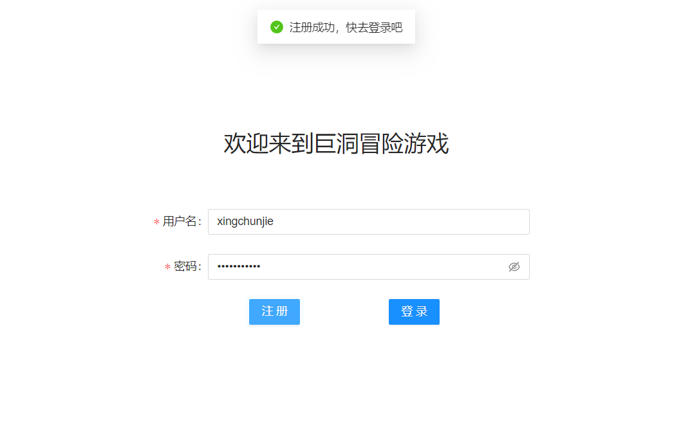
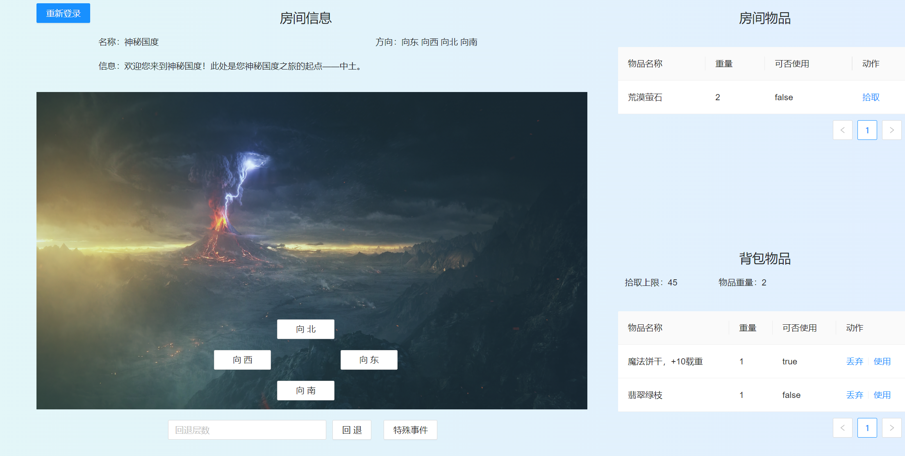

<h1 align="center">软件工程实践：小组开发报告</h1>

## 1. 开发小组成员

组长：邢淳杰

组员：无

外援：陶志远

补充说明：邢淳杰（我）之前因身体原因休学，复学后办理了校外住宿，因为跟20级的同学不太熟悉，沟通也不太方便，再加上有关合作开发（github分支合并、代码冲突、版本回退）的内容我之前在大三上的时候和室友做课程设计都有实践过，也算是比较熟悉了，这次实在是不太方便，所以这次实践课程就自己一个人作为一个小组，自己一个人写一下后端。前端的内容我原本准备自己尝试一下，但由于难度比较大（其实是因为我前端太菜），再加上期末任务繁重时间紧迫，预感到无法在截止期限以前完成前端的开发工作，所以找了一个外援陶志远同学来完成前端的开发工作。我们使用接口管理工具Apifox进行前后端接口的对接和测试。

<br><br>

## 2. 需求分析与总体设计

### 2.1 确定需求

经过讨论，小组确定功能扩充需求点如下：

1. 扩展游戏，一个房间里可以存放任意数量的物件，每个物件有一个描述和一个重量值，玩家进入一个房间后，查看当前房间的信息以及房间内的所有物品信息；
2. 扩展并实现一个高级“back”命令功能，可以一次性回退到指定步数（可以回到前一次进入的Room，也可以回到前n次进入的Room）；
3. 在游戏中实现具有传送功能的房间，当玩家进入这个房间，会被传送到游戏地图的其它房间；
4. 玩家在游戏中的功能需求：
   * 一个玩家因该与它的用户相关联（绑定）
   * 玩家可以随身携带任意数量的物件，但随身物品的总重量不能操过某个上限值；
   * 在游戏中增加两个新的命令“take”和“drop”，使得玩家可以拾取房间内的指定物品或丢弃身上携带的某件或全部物品，当拾取新的物件时超过了玩家可携带的重量上限，系统应给出提示；
   * 在游戏中增加一个新的命令“items”, 可以打印出当前房间内所有的物件及总重量，以及玩家随身携带的所有物件及总重量；
   * 在某个或某些房间中随机增加一个magic cookie（魔法饼干）物件，并增加一个“eat cookie”命令，如果玩家找到并吃掉魔法饼干，就可以增长玩家的负重能力；
5. 扩充游戏基本架构，使其支持网络多人游戏模式，具备玩家登陆等功能；
6. 为单机或网络版游戏增加图形化用户界面，用过可以通过图形化界面执行游戏功能；
7. 为游戏增加数据库功能，用于保存用户设置；

<br>

### 2.2 需求分析与技术选型

游戏要有用户登录/注册的功能，要有交互界面，所以采用前后端分离的方式进行开发。经过综合考虑，我们决定采用B/S架构进行开发，前端通过浏览器页面进行展示，并实现与用户的交互，后端部署在服务器上，提供数据处理、实现游戏核心逻辑等服务。用户的信息通过数据库进行持久化存储。

前后端具体的技术栈将在后续章节中列出。

<br>

### 2.3 游戏逻辑设计

注：游戏逻辑设计对标开发过程中的前后端接口设计。

* 用户
  * 注册
  * 登录
* 玩家
  * 获取当前房间信息
  * 获取自身信息
  * 可以控制移动（向东、向南、向西、向北）
  * 回退指定层数
  * 拿起当前房间中的物品
  * 将背包中的物品放置到当前房间
  * 执行房间事件

<br>

### 2.4 游戏背景设计

在遥远的卡兰多大陆，有一个古老而神秘的国度。它幅员辽阔，有绵延巍峨的崇山峻岭，有一望无际的沃土良田，有瑰丽繁华的浪漫之城，有千里冰封的林海雪原。这里有无数的机遇，更有无限可能，最令人神往的，便是有关“沙漠绿洲”的美丽传说……

当然，这里也有令人谈之色变的存在……比如，那异象频生的上古遗址……再比如上古遗址以南，传说里人们有去无回的风暴肆虐之地……

在某种神秘力量的引导下，你降临到了神秘国度——中土……

<br><br>

## 3. 后端项目详细开发记录

### 3.1 总体介绍

#### 3.1.1 相关技术栈

> 1. `Spring Boot`   负责相关配置，提供IOC及AOP支持。
> 2. `Spring MVC`   本项目使用SpringBoot进行配置，沿用并整合了SpringMVC框架，通过SpringMVC实现与前端的交互。
> 3. `MySQL + druid`   数据库及连接池，对用户信息进行持久化存储。
> 4. `MyBatis Plus`   数据库ORM框架，便于开发。
> 5. `Lombok 插件`    提供相关注解（用于自动生成类的getter、setter、equals、hashCode、toString方法），简化开发。
> 6. `JWT`   为前后端数据交互提供鉴权服务。
> 7. `Swagger`   便于编写接口文档。
> 8. `Apifox` 前后端测试

<br>

#### 3.1.2 后端实现的需求

1. 扩展游戏，一个房间里可以存放任意数量的物件，每个物件有一个描述和一个重量值，玩家进入一个房间后，查看当前房间的信息以及房间内的所有物品信息；
2. 扩展并实现一个高级“back”命令功能，可以一次性回退到指定步数（可以回到前一次进入的Room，也可以回到前n次进入的Room）；
3. 在游戏中实现具有传送功能的房间，当玩家进入这个房间，会被传送到游戏地图的其它房间；
4. 玩家在游戏中的功能需求：
   * 一个玩家因该与它的用户相关联（绑定）
   * 玩家可以随身携带任意数量的物件，但随身物品的总重量不能操过某个上限值；
   * 在游戏中增加两个新的命令“take”和“drop”，使得玩家可以拾取房间内的指定物品或丢弃身上携带的某件或全部物品，当拾取新的物件时超过了玩家可携带的重量上限，系统应给出提示；
   * 在游戏中增加一个新的命令“items”, 可以打印出当前房间内所有的物件及总重量，以及玩家随身携带的所有物件及总重量；
   * 在某个或某些房间中随机增加一个magic cookie（魔法饼干）物件，并增加一个“eat cookie”命令，如果玩家找到并吃掉魔法饼干，就可以增长玩家的负重能力；
5. 扩充游戏基本架构，使其支持网络多人游戏模式，具备玩家登陆等功能；
6. 为游戏增加数据库功能，用于保存用户设置；

<br>

#### 3.1.3 UML设计

<br>

#### 3.1.4 基于issue进行工作任务管理及分配

后端由[AnthonyCJ (github.com)](https://github.com/AnthonyCJ)进行开发，分配任务较为合理（强颜欢笑，我也不想这样啊，真的要累死了，可是我不得不一个人战斗……等我熬不住了我就去找个前端外援）。[AnthonyCJ (github.com)](https://github.com/AnthonyCJ)在`Milestones`内完成了自己的任务，并且提交的`git commit message`格式依照阿里巴巴开发规范。

* issue
  * refactor(Spring Boot): 重构设计，将后端Spring MVC项目重构为Spring Boot项目，明确变更细节，正确搭建框架
    1. 添加 SpringBoot 相关依赖（boot-starter-web, boot-starter-test等）
    2. 配置 SpringBoot 应用
       web.xml和SpringMVC配置文件变更为启动类注解
    3. 配置 SoringBoot 相关参数
       在application.yml中配置，注意区分开发环境和生产环境
    4. 迁移 SpringMVC 的代码
       注意一些细节上的变动
  * feat(Pojo): 完成游戏后端实现逻辑的设计，底层数据结构的设计，数据类型的设计与实现
  * feat(Service, Controller): 新增PlayerController相关功能，编写对应的接口，并撰写部分接口文档
  * feat(Mapper, Service): 编写Mapper层接口，实现实体类的Service服务
  * feat(Mapper, Service, Pojo): 编写有关游戏功能实现与逻辑的单元测试，并完成测试
  * feat(Service, Controller): 完成Service层的开发，补全Controller层相关服务
  * feat(Service): 完成后端接口的编写，在后端本地使用后端开发环境对后端接口进行测试，完成Apifox接口文档的编写
  * chore(CI/CD): 添加CI/CD流程
* 里程碑事件
  * 搭建后端开发框架以及CI/CD流程
  * 完成后端功能测试、后端接口编写与测试


<br>

#### 3.1.5 开发分支规定及开发流程

我创建了一个anthonycj子分支，开发时在子分支上进行开发，开发完毕后通过子分支commit并push到远程仓库，再通过master分支进行合并，最后通过github actions进行打包发布到云服务器上。

<br>

#### 3.1.6 配置CI/CD

在github里面一直没找到设置

```yml
host: ${{ secrets.HOST }}
user: ${{ secrets.SSH_USER }}
key: ${{ secrets.SSH_PRIVATE_KEY }}
```

的地方，所以自动化部署一直编译失败，所以我把jar包部署在了云服务器上，通过Apifox与前端交互。


```yml
# This workflow will build a Java project with Maven, and cache/restore any dependencies to improve the workflow execution time

name: Java CI/CD with Maven

on:
push:
branches: [ master ]
pull_request:
branches: [ master ]

jobs:
build-and-deploy:
runs-on: ubuntu-latest
name: Running Java ${{ matrix.java }} compile
steps:
# 使用checkout@v1进行CI/CD，只clone最新版本
- uses: actions/checkout@v1
with:
fetch-depth: 1

# 安装JDK1.8
- name: 安装 JDK 1.8
uses: actions/setup-java@v1
with:
java-version: 1.8

# 缓存Maven依赖
- name: 缓存 Maven 依赖
uses: actions/cache@v2
with:
path: ~/.m2/repository
key: ${{ runner.os }}-maven-${{ hashFiles('**/pom.xml') }}
restore-keys: ${{ runner.os }}-maven-

- name: mvn compile
run: mvn compile

- name: mvn package
run: mvn -B package --file pom.xml -Dmaven.test.skip=true

- name: 将 JAR 包部署到服务器
uses: wlixcc/SFTP-Deploy-Action@v1.0
with:
username: ${{ secrets.SSH_USER }}
server: ${{ secrets.HOST }}
ssh_private_key: ${{ secrets.SSH_PRIVATE_KEY }}
local_path: './target/zuul.jar'
remote_path: '/usr/local/src/zuul/zuul.jar'
args: '-o ConnectTimeout=5'

- name: 停止服务器原有服务，后台运行zuul.jar
if: always()
uses: fifsky/ssh-action@master
with:
command: |
ps -ef | grep "zuul.jar" | grep -v grep | awk '{print $2}' | xargs kill -9
cd /usr/local/src/zuul
nohup java -jar zuul.jar --spring.profiles.active=prod > nohup.out 2>&1 &
host: ${{ secrets.HOST }}
user: ${{ secrets.SSH_USER }}
key: ${{ secrets.SSH_PRIVATE_KEY }}
```

### 3.2 模块设计

#### 3.2.1 设计整体框架

后端服务整体使用`Spring Boot`框架进行开发，使用`.yml`文件进行项目配置，分为`Pojo`，`Mapper`, `Service`，`Controller`进行开发，`pojo`作为实体对象类，`Mapper`层控制与数据库交互，获取相关数据，`Service`层实现相关接口配合`Pojo`和`Mapper`层调用实现功能，`Controller`层用来处理与前端的交互，返回`Json`数据。

其中`Json`数据的格式定义如下：

```java
@Data
@JsonInclude(JsonInclude.Include.NON_NULL)
public class ResultBean<T> implements Serializable {
    
    @ApiModelProperty(value="返回的状态码", example = "500701")
    private int code;       // 状态码
    
    @ApiModelProperty(value="状态码对应的消息值", example = "token已失效")
    private String msg;     // 消息值
    
    @ApiModelProperty(value="返回数据", example = "返回的对应数据")
    private T data;         // 返回值
    
    public ResultBean(EnumResult enumResult, T data){
        this.code=enumResult.getCode();
        this.msg=enumResult.getMsg();
        this.data=data;
    }
    public ResultBean(EnumResult enumResult){
        this.code=enumResult.getCode();
        this.msg=enumResult.getMsg();
    }
}
```

通过与前端约定的状态码以及消息值，数据进行交互，状态码与消息值的对应关系使用枚举类进行存储：

```java
public enum EnumResult {
    SUCCESS(200200, "请求成功"),
    INTERNAL_SERVER_ERROR(500500, "服务器内部错误"),
    USER_REPEAT(500101, "用户名重复或未提供数据"),
    USER_LOGIN_ERROR(500102, "用户登录失败"),
    USER_MOVE_FAIL(500201, "用户移动失败"),
    USER_TAKE_FAIL(500301, "不存在该物品或用户拿起该物品超重"),
    USER_NO_HOLD_ITEM(500302, "用户未持有该物品"),
    USER_USE_ITEM_FAIL(500303, "该物品不能被使用"),
    ROOM_NO_EVENT(500401, "房间不含有可用事件"),
    TEST_FAIL(500601, "您没有执行相关功能的权限"),
    TOKEN_ERROR(500701, "token已失效"),
    TOKEN_MISS(500702, "token不存在");
    private int code;
    private String msg;

    EnumResult(int code, String msg) {
        this.code = code;
        this.msg = msg;
    }
}
```

#### 3.2.2 设计登录鉴权及拦截器

用户的权限校验采用`JWT`技术，在调用`login`接口进行登录后，如果数据库中存在用户数据，会根据服务器的密钥信息生成一个字符串——`token`，在之后执行其他操作时，将`token`字符串附在`headers`的`authorization`中，后端会对前端的请求进行校验，通过后放行。

```java
/**
 * 生成签名,EXPIRE_TIME(毫秒)后过期.
 *
 * @param userId 用户id
 * @param username 用户名
 * @return 加密的token
 */
public static String sign(Long userId, String username) {
    try {
        // 过期时间
        Date date = new Date(System.currentTimeMillis() + EXPIRE_TIME);
        // 私钥及加密算法
        Algorithm algorithm = Algorithm.HMAC256(TOKEN_SECRET);
        // 设置头部信息
        Map<String, Object> header = new HashMap<>(2);
        header.put("typ", "JWT");
        header.put("alg", "HS256");
        // 附带username，userId信息，生成签名，允许
        return JWT.create()
                .withHeader(header)
                .withClaim("username", username)
                .withClaim("userId", userId)
                .withExpiresAt(date)
                .sign(algorithm);
    } catch (UnsupportedEncodingException e) {
        return null;
    }
}
```

通过实现了`Interceptor`接口，实现了一个鉴权拦截器，用户在调用`login`和`register`接口时会予以放行，但是在调用其他接口时会被拦截器拦截，校验用户的身份以及权限。

```java
/**
 * @author anthonycj
 * @version 1.0
 * @description 校验用户登录权限
 * @date 2023/6/22 20:32
 */
@Component
public class CheckInterceptor implements HandlerInterceptor {

    @Override
    public boolean preHandle(HttpServletRequest request, HttpServletResponse response, Object handler) throws Exception {
        String token = request.getHeader("Authorization");
        if (JwtUtil.verify(token)) {
            // 说明验证成功，允许访问资源
            return true;
        } else {
            response.setCharacterEncoding("utf-8");
            response.setContentType("application/json; charset=utf-8");
            response.getWriter().write(JsonUtil.objToJson(new ResultBean<>(EnumResult.TOKEN_ERROR)));
            return false;
        }
    }
}
```

最后在`webConfig`类中继承`WebMvcConfigurer`，实现跨域请求以及添加拦截器，拦截路由以及过滤特定路由`login`和`register`

```java
@Configuration
public class WebConfig implements WebMvcConfigurer {

    @Autowired
    private CheckInterceptor checkInterceptor;

    @Override
    public void addCorsMappings(CorsRegistry registry) {
        // 项目中的所有接口都支持跨域
        registry.addMapping("/**")
                .allowedOriginPatterns("*")
                .allowCredentials(true)
                .allowedMethods("*")
                .maxAge(3600);
    }

    @Override
    public void addInterceptors(InterceptorRegistry registry) {
        // 添加鉴权拦截器，拦截所有请求，排除登录相关的API调用
        registry.addInterceptor(checkInterceptor)
                .addPathPatterns("/**")
                .excludePathPatterns("/user/login", "/user/register", "/test/**",
                        "/swagger-ui.html", "/swagger-resources/**", "/webjars/**", "/v2/**", "/swagger-ui.html/**");
        WebMvcConfigurer.super.addInterceptors(registry);
    }
}
```

#### 2.2.3 设计User类

`User`类的设计比较简单，用户使用唯一索引的用户名以及密码进行登录，项目比较简单所以也没有做校验以及加密，由于使用了`MyBatis Plus`因此开发`Mapper`层比较简单，我们的设计是，每一个用户对应一个`User`对象，通过这个`User`对象的`userId`属性作为`ConcurrentHashMap`的`key`，其对应的`Player`(游戏中的角色)作为`value`进行映射，因此在服务器不重启之前，游戏的角色都可以被缓存。

**User.java: **

```java
/**
 * @author anthonycj
 * @version 1.0
 * @description 用户实体类
 * @date 2023/6/21 22:15
 */
@Data
@NoArgsConstructor
@AllArgsConstructor
@TableName("user")
public class User {
    @JsonSerialize(using = ToStringSerializer.class)
    @TableId(type = IdType.AUTO)
    @ApiModelProperty(value = "用户Id", hidden = true, example = "19")
    private Long userId;

    @ApiModelProperty(value = "登录用户名", example = "admin1")
    private String userName;

    @ApiModelProperty(value = "登录用户密码", example = "p@ssword")
    private String userPassword;
}
```

**UserServiceImpl.java:** 

```java
/**
 * @author anthonycj
 * @version 1.0
 * @description UserService接口的实现类
 * @date 2023/6/21 22:21
 */
@Service
public class UserServiceImpl extends ServiceImpl<UserMapper, User> implements UserService {

    @Autowired
    private UserMapper userMapper;

    /**
     * 用户登录.
     *
     * @param userName 登录的用户名
     * @param userPassword 登录的用户密码
     * @return 若登录成功，则返回用户类，否则返回null
     */
    @Override
    public User userLogin(String userName, String userPassword) {
        User user = userMapper.selectOne(new QueryWrapper<User>().eq("user_name", userName));
        if(user != null && userPassword != null && !"".equals(userPassword)) {
            if(userPassword.equals(user.getUserPassword())) {
                return user;
            } else {
                return null;
            }
        }
        return null;
    }
}
```

**UserController.java: **

```java
/**
 * @author anthonycj
 * @version 1.0
 * @description UserController，实现用户登录，注册等相关功能
 * @date 2023/6/22 15:15
 */
@Api(tags = {"用户操作"})
@RestController
@RequestMapping("/user")
public class UserController {

    @Autowired
    private UserService userService;

    /**
     * 注册用户User.
     *
     * @param user 需要插入数据库的用户信息，使用body传递json数据
     * @return 若重复用户名或用户信息为空报错
     */
    @ApiOperation(value = "用户注册", notes = "提供用户名以及密码进行注册")
    @ApiImplicitParam(name = "user", value = "用户注册信息Json数据", required = true, dataType = "User")
    @PostMapping("/register")
    public ResultBean<Object> registerUser(@RequestBody User user) {
        if(user == null || userService.getOne(new QueryWrapper<User>().
                eq("user_name", user.getUserName())) != null) {
            // 说米国没有提供user或者查询到了重复的用户名，报错
            return new ResultBean<>(EnumResult.USER_REPEAT);
        } else {
            // 说明请求成功
            if(userService.save(user)) {
                return new ResultBean<>(EnumResult.SUCCESS);
            } else {
                return new ResultBean<>(EnumResult.INTERNAL_SERVER_ERROR);
            }
        }
    }

    /**
     * 用户登录.
     *
     * @param user 需要登录的用户
     * @return 若登录成功则颁发token允许之后的鉴权，否则返回错误信息
     */
    @ApiOperation(value = "用户登录", notes = "提供用户名以及密码进行登录")
    @ApiImplicitParam(name = "user", value = "用户登录信息Json数据", required = true, dataType = "User")
    @PostMapping("/login")
    public ResultBean<Object> tryLogin(@RequestBody User user) {
        User tmpUser = userService.userLogin(user.getUserName(), user.getUserPassword());
        if(tmpUser != null) {
            // 说明登录成功，生成一个token
            String token = JwtUtil.sign(tmpUser.getUserId(), tmpUser.getUserName());
            return new ResultBean<>(EnumResult.SUCCESS, token);
        } else {
            // 登录失败
            return new ResultBean<>(EnumResult.USER_LOGIN_ERROR);
        }
    }
}
```

#### 3.2.4 设计GameMap类

`GameMap`类是该游戏的地图类，其中包含了很多的`Room`，我使用了`HashMap`通过`<Long, Room>`进行映射，地图是我自己画的。使用`Spring Boot`提供的`@Bean`注解将`Maze`进行初始化，作为单例。

#### 3.2.5设计Room类

`Room`类为了提供房间事件(例如随机传送的房间)，定义了`Room`作为父类，含有特殊功能的房间需要继承`Room`类并实现`Event`接口，之后在`Controller`层可以通过是否实现了`Event`接口进行判断。

> 此处创建房间时，考虑之后若升级项目可以同时存在多个地图以及多个房间时并且要对`Player`做持久化，因此使用了雪花算法生成全局唯一ID，使用的类型为`Long`，其实就算调用`MaBatis Plus`的自动主键生成策略也会生成`Long`类型的主键，因此肯定会碰到下述bug：
>
> 前端因为使用动态类型，整型的精确范围只能到53位，实测之后会类似浮点数的存储采用科学计数法，无法保证精度，导致id如果以long类型传递会在前端丢失精度。因此我在后端将long类型通过`jackson`提供的`@JsonSerialize`注解转换成`String`类型保证不丢失精度。

#### 3.2.6 设计Item类

Item 类拥有三个字段，分别是 id, name, weight。Item是一个典型的POJO，只有字段，不含各种逻辑，达到了解耦的目的。

#### 3.2.7 设计Player类

Player类，对应游戏中控制的人物，是我们这款简易游戏中的核心类，它关联着房间、物品的信息。


## 4. 前端项目概述

前端主要使用 Vue、Vue-router、Ant Design Vue 等框架实现。Vue 具有响应式的数据绑定和虚拟 DOM 等特性，提供了更好的用户交互体验；Vue-router 允许我们在单页面应用中实现客户端路由；Ant Design Vue 提供了丰富的UI组件和交互样式，使得前端开发更加高效和便捷。

项目主要有两个页面，首先是登录注册页面，完成了基本的登录注册功能。



游戏页面主要分为四个区域，分别是房间信息、房间物品、操作区域、背包物品区域。



1. 房间信息区域介绍了房间的名称、可以前进的方向、房间信息和房间图片。
2. 房间物品区域展示房间当前的物品，包括物品名称、重量、可否使用和可进行的操作。
3. 操作区域可以控制玩家移动、回退若干层和触发特殊事件。
4. 背包物品区域展示了背包内的物品信息、玩家的拾取上限和物品重量。

在编写代码的过程中将这些区域封装成了一个个组件，使用组件化开发使代码更清晰。

